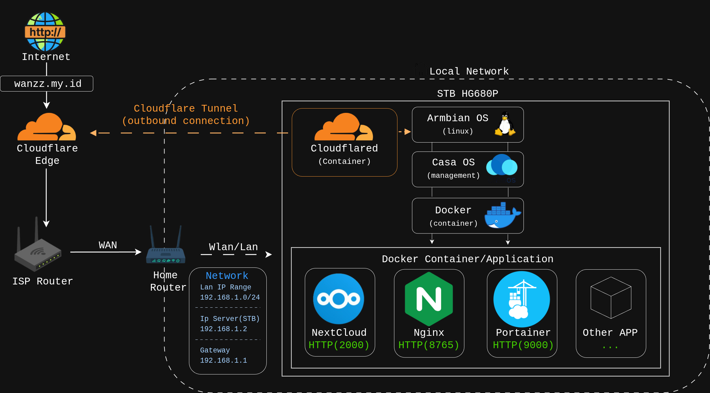

# 🚀 My Budget-Friendly Home Lab: ARM64 Infrastructure & Self-Hosting

Welcome to my Home Lab repository! This project documents my journey of repurposing an unused Android TV Box into a fully functional, low-power Linux mini-server. 

My primary goal is to build an efficient, cost-effective infrastructure to learn system administration, containerization, and secure remote networking.

---

## 🖥️ Hardware Specifications

Instead of buying expensive enterprise equipment, I optimized what I had. This setup proves that you can run a capable server environment on highly constrained resources.

* **Device Model:** STB HG680p (Repurposed Android TV Box)
* **Architecture:** ARM64
* **RAM:** 2 GB
* **ROM:** 8 GB eMMC
* **External Storage:** 32 GB USB Flash Drive (Used for boot & main storage)

---

## 🗺️ Network Topology

Below is a simple diagram illustrating how my home lab is structured, from the local network setup to how it securely connects to the outside world.



---

## 🛠️ Base OS & Provisioning

To turn the Android TV box into a server, I replaced the stock Android OS with a lightweight Linux distribution.

1. **OS Selection:** I am running **Armbian OS (v25.05.00)**, sourced from a local Mini Server community.
2. **Flashing Process:** I used **BalenaEtcher** to flash the Armbian image onto the 32GB USB Drive.
3. **Troubleshooting the Boot Sequence:** Initially, the STB refused to boot from the USB drive and booted straight into Android. After consulting with the community, I discovered that triggering a forced reboot while the USB was plugged in would interrupt the bootloader and successfully boot into Armbian.

---

## 📦 Containerization & Management

To keep the system clean and make application deployments easier, I utilize Docker. To simplify container management, I use **CasaOS** as my primary dashboard.

**Installing Docker Engine:**
```bash
sudo apt-get update
sudo apt-get install docker-ce

```

**Installing CasaOS:**

```bash
curl -fsSL get.casaos.io/install.sh | sudo bash

```
---

☁️ Self-Hosted NAS: Nextcloud + MariaDB + Redis
To manage and securely store my personal data, I deployed a private NAS using Nextcloud. To ensure high performance and low resource footprint on ARM64 hardware, the stack is optimized with MariaDB 11 for database management and Redis for memory caching.

1. Directory & Storage Setup
First, I created the dedicated container directories and configured the external storage mount point permissions for Nextcloud's www-data user (UID 33):

Bash
# Create directory structure
mkdir -p ~/docker/nextcloud/{nextcloud,mariadb,redis}
cd ~/docker/nextcloud

# Create and set permissions for external storage
sudo mkdir -p /mnt/storage/nextcloud-data
sudo chown -R 33:33 /mnt/storage/nextcloud-data
2. Docker Compose Configuration
Created the compose.yml file to orchestrate the Nextcloud stack:

YAML
services:
  db:
    image: mariadb:11
    container_name: nextcloud-db
    restart: unless-stopped
    command: --transaction-isolation=READ-COMMITTED --binlog-format=ROW
    environment:
      MYSQL_ROOT_PASSWORD: <YOUR_MYSQL_ROOT_PASSWORD>
      MYSQL_DATABASE: nextcloud
      MYSQL_USER: nextcloud
      MYSQL_PASSWORD: <YOUR_MYSQL_PASSWORD>
      MYSQL_INITDB_SKIP_TZINFO: "1"
    volumes:
      - ./mariadb:/var/lib/mysql

  redis:
    image: redis:7-alpine
    container_name: nextcloud-redis
    restart: unless-stopped

  app:
    image: nextcloud:latest
    container_name: nextcloud
    restart: unless-stopped
    ports:
      - "8090:80"
    depends_on:
      - db
      - redis
    environment:
      MYSQL_DATABASE: nextcloud
      MYSQL_USER: nextcloud
      MYSQL_PASSWORD: <YOUR_MYSQL_PASSWORD>
      MYSQL_HOST: db
      REDIS_HOST: redis
    volumes:
      - ./nextcloud:/var/www/html
      - /mnt/storage/nextcloud-data:/var/www/html/data
Deploying the stack:

Bash
docker compose up -d
3. Secure Remote Access & Trusted Domains
I exposed Nextcloud securely using Cloudflare Tunnel routed to cld.wanzz.my.id pointing to http://192.168.1.2:8090.

To allow Nextcloud to accept incoming requests from the Cloudflare domain, I edited Nextcloud's config.php:

Bash
nano ~/docker/nextcloud/nextcloud/config/config.php
Added the domain under the trusted_domains array:

PHP
'trusted_domains' => 
  array (
    0 => '192.168.1.2:8090',
    1 => 'cld.wanzz.my.id',
  ),
---

## 🌐 Networking & Secure Remote Access

I wanted to access my CasaOS dashboard and other self-hosted services from anywhere without compromising my home network's security. Since I am behind a standard ISP router, traditional Port Forwarding was not ideal.

**Solution: Cloudflare Tunnel (Zero Trust)**
I purchased a personal domain (`wanzz.my.id`) and implemented a Cloudflare Tunnel. This creates a secure, outbound-only connection to Cloudflare's edge, allowing me to expose my local services safely.

**1. Installing `cloudflared` on Armbian:**

```bash
sudo mkdir -p --mode=0755 /usr/share/keyrings
curl -fsSL [https://pkg.cloudflare.com/cloudflare-main.gpg](https://pkg.cloudflare.com/cloudflare-main.gpg) | sudo tee /usr/share/keyrings/cloudflare-main.gpg >/dev/null

echo 'deb [signed-by=/usr/share/keyrings/cloudflare-main.gpg] [https://pkg.cloudflare.com/cloudflared](https://pkg.cloudflare.com/cloudflared) any main' | sudo tee /etc/apt/sources.list.d/cloudflared.list

sudo apt-get update && sudo apt-get install cloudflared

```

**2. Authenticating & Running the Service:**

```bash
sudo cloudflared service install <CLOUDFLARE_TOKEN>
sudo systemctl start cloudflared

```

I use Cloudflare Tunnel to access my home lab applications from anywhere without exposing open inbound ports on my home router.

CasaOS Dashboard: casa.wanzz.my.id
Nextcloud Private Cloud: cld.wanzz.my.id

**Result:** I successfully routed `casa.wanzz.my.id` and `cld.wanzz.my.id` through the tunnel to my local CasaOS and NextCloud port. I can now manage my server securely from anywhere in the world!

---

## 📈 Future Projects (Roadmap)

Since this is an ongoing project, here are a few things I plan to implement next:

* [x] Repurpose Android TV Box into a Linux Server.
* [x] Implement secure remote access via Cloudflare Tunnel.
* [ ] Deploy an ad-blocker (Wireguard / AdGuard Home) for the local network
* [x] Set up a personal cloud storage solution (Nextcloud).

---

*If you have any questions or suggestions regarding this setup, feel free to open an Issue or reach out!*
